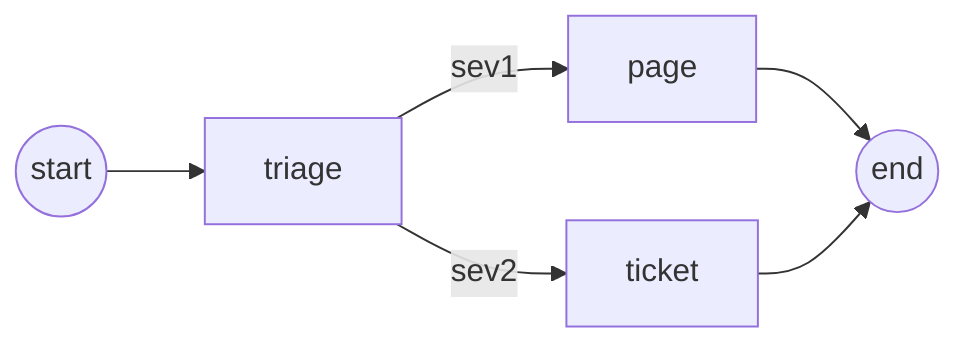

# LangEx

[](https://github.com/surgeventures/lang_ex/actions/workflows/ci.yaml)
[](https://hex.pm/packages/lang_ex)
[](https://hexdocs.pm/lang_ex)
[](https://github.com/surgeventures/lang_ex/blob/main/LICENSE)

Stateful LLM agents for Elixir. You write functions, wire them into a graph, and the BEAM keeps the run alive — across tool calls, crashes, and a human saying "wait."

```elixir
alias LangEx.Message
alias LangEx.Tool

lookup = %Tool{
  name: "lookup_service",
  description: "Health, last deploy, and error rate for a service.",
  parameters: %{
    type: "object",
    properties: %{name: %{type: "string"}},
    required: ["name"]
  },
  function: fn
    %{"name" => "api-gateway"} ->
      %{status: :degraded, error_rate: 0.12, last_deploy: ~U[2026-08-25 09:14:00Z]}

    %{"name" => name} ->
      %{status: :healthy, error_rate: 0.0, name: name}
  end
}

agent =
  LangEx.Prebuilt.agent(
    model: "claude-sonnet-4-20250514",
    system_prompt: "You are on-call. Diagnose with tools, then recommend the next action.",
    tools: [lookup]
  )

{:ok, result} =
  LangEx.invoke(agent, %{messages: [Message.human("api-gateway 5xxs just spiked")]})
```

That is a tool-calling loop: the model decides when to call `lookup_service`, LangEx runs the function, and the conversation continues until there is an answer. Swap the stub for your metrics client. Add a checkpointer and the same agent survives a deploy.

Inspired by [LangGraph](https://www.langchain.com/langgraph). Built on functions, messages, and supervisors — not threads and async/await.

## Why LangEx

- **Graphs are data.** Nodes are functions. Edges are routes. `compile/1` freezes the shape; `invoke/3` runs it. No GenServer per conversation.
- **Checkpoints, not processes.** Memory, Redis, or Postgres. Crash mid-step, resume the thread. Pause for a human, come back tomorrow.
- **Parallel is a `Task.Supervisor`.** Tool calls and sibling nodes run concurrently. One failing agent does not take the VM with it.
- **Streaming is `Stream`.** Token deltas, node events, interrupts — pipe them to a LiveView, a channel, or `IO.write/1`.

## Installation

```elixir
def deps do
  [
    {:lang_ex, "~> 0.13.0"},
    {:redix, "~> 1.5"},       # optional — Redis checkpoints
    {:postgrex, "~> 0.19"},   # optional — Postgres checkpoints
    {:ecto_sql, "~> 3.12"}
  ]
end
```

API keys resolve from opts, then application config, then the environment (`ANTHROPIC_API_KEY`, `OPENAI_API_KEY`, `GEMINI_API_KEY`). Model strings pick the provider: `"claude-…"`, `"gpt-…"`, `"gemini-…"`.

```elixir
config :lang_ex, :anthropic, api_key: System.get_env("ANTHROPIC_API_KEY")
```

## A graph you can read

`Prebuilt.agent/1` is the 80% path. When the workflow has a shape — triage, then a specialist, then a side effect — you write that shape down.

```elixir
defmodule Incident.Graph do
  alias LangEx.Graph
  alias LangEx.Message

  def build do
    Graph.new(messages: {[], &Message.add_messages/2}, severity: nil)
    |> Graph.add_node(:triage, &triage/1)
    |> Graph.add_node(:page, &page/1)
    |> Graph.add_node(:ticket, &ticket/1)
    |> Graph.add_edge(:__start__, :triage)
    |> Graph.add_conditional_edges(:triage, & &1.severity, %{
      sev1: :page,
      sev2: :ticket
    })
    |> Graph.add_edge(:page, :__end__)
    |> Graph.add_edge(:ticket, :__end__)
    |> Graph.compile()
  end

  defp triage(%{messages: messages}), do: %{severity: severity(List.last(messages))}

  defp severity(%{content: content}), do: severity_for(String.downcase(content))
  defp severity_for(text) when text =~ "down", do: :sev1
  defp severity_for(text) when text =~ "5xx", do: :sev1
  defp severity_for(_text), do: :sev2

  defp page(_state), do: %{messages: [Message.ai("Paging the primary on-call.")]}
  defp ticket(_state), do: %{messages: [Message.ai("Opened a ticket for the rotation.")]}
end

{:ok, %{severity: :sev1}} =
  LangEx.invoke(Incident.Graph.build(), %{
    messages: [LangEx.Message.human("api-gateway 5xxs just spiked")]
  })
```

State keys can carry reducers (`messages: {[], &Message.add_messages/2}` appends and dedupes). Nodes return a patch, not the whole state. Replace `triage/1` with `LangEx.LLM.ChatModel.node/1` when the model should pick the route.



## Pause, persist, resume

`interrupt/1` inside a node pauses the run and surfaces a payload. Resume with `%LangEx.Command{resume: value}` on the same `thread_id`. A checkpointer is required — the thread has to live somewhere while the human thinks.

```elixir
alias LangEx.Command
alias LangEx.Graph
alias LangEx.Interrupt

graph =
  Graph.new(action: nil)
  |> Graph.add_node(:plan, fn _state -> %{action: {:restart, "api-gateway"}} end)
  |> Graph.add_node(:gate, fn state ->
    %{action: Interrupt.interrupt({:approve, state.action})}
  end)
  |> Graph.add_node(:apply, fn %{action: action} -> %{applied: action} end)
  |> Graph.add_edge(:__start__, :plan)
  |> Graph.add_edge(:plan, :gate)
  |> Graph.add_edge(:gate, :apply)
  |> Graph.add_edge(:apply, :__end__)
  |> Graph.compile(checkpointer: LangEx.Checkpointer.Postgres)

config = [thread_id: "inc-4821", repo: MyApp.Repo]

{:interrupt, {:approve, {:restart, "api-gateway"}}, _state} =
  LangEx.invoke(graph, %{}, config: config)

{:ok, _result} =
  LangEx.invoke(graph, %Command{resume: {:restart, "api-gateway"}}, config: config)
```

| | Memory | Redis | Postgres |
|---|---|---|---|
| **Use** | Tests, a single VM | Fast, shared across nodes | Durable, transactional |
| **Setup** | Built in | add `redix` | add `ecto_sql`, run `LangEx.Migration.up()` |

## Stream

`LangEx.stream/3` is the same contract as `invoke/3`, as a lazy stream — including token deltas from the model:

```elixir
agent
|> LangEx.stream(%{messages: [LangEx.Message.human("status of payments?")]}, modes: [:messages])
|> Stream.each(fn
  {:message_delta, %{text: chunk}} -> IO.write(chunk)
  {:done, {:ok, _state}} -> IO.write("\n")
  _event -> :ok
end)
|> Stream.run()
```

Pipe that into a PubSub topic, a Phoenix channel, or a LiveView. Errors from a node are `{:error, %LangEx.NodeError{}}`, never an uncaught raise out of `invoke/3`.

## Teams

A **swarm** hands the conversation to a peer and stays there across turns. A **supervisor** delegates a task and takes the reply back.

```elixir
graph =
  LangEx.Prebuilt.Swarm.create(
    agents: [
      [name: :router, model: "gpt-4o", system_prompt: "Route the user to a specialist."],
      [name: :refunds, model: "gpt-4o", system_prompt: "Handle refunds. Be specific about timing."]
    ],
    default_active_agent: :router,
    checkpointer: LangEx.Checkpointer.Memory
  )

{:ok, state} =
  LangEx.invoke(graph, %{messages: [LangEx.Message.human("I want a refund")]},
    config: [thread_id: "ticket-17"]
  )
```

Each agent gets a `transfer_to_<peer>` tool. The active agent is just state, so the next message on that thread continues with whoever last spoke.

## Middleware

Layer behaviour around `Prebuilt.agent/1` without changing the graph. Summarise old turns, require a human before `restart_service`, cap the bill:

```elixir
LangEx.Prebuilt.agent(
  model: "claude-sonnet-4-20250514",
  tools: ops_tools,
  middleware: [
    LangEx.Middleware.Summarization.new(model: "claude-haiku-4-5-20251001"),
    LangEx.Middleware.ToolApproval.new(tools: ["restart_service"]),
    LangEx.Middleware.CallBudget.new(max_model_calls: 20)
  ]
)
```

Also in the box: subgraphs, `%LangEx.Send{}` fan-out, per-node retry / timeout / cache, encrypted checkpoints, a long-term `LangEx.Store`, OpenTelemetry. Custom providers implement `LangEx.LLM` and register with `LangEx.LLM.Registry`.

## Examples

Runnable scripts — most offline, no API key:

```bash
elixir examples/scripts/01_quick_start.exs
```

| Example | What it shows |
|---|---|
| [Feature scripts](https://github.com/surgeventures/lang_ex/tree/main/examples/scripts) | One file per idea: routing, streaming, interrupts, crash recovery, teams, middleware |
| [Incident responder](https://github.com/surgeventures/lang_ex/tree/main/examples/incident_responder) | DevOps agent, tool chains, Postgres checkpoints |
| [Support triage](https://github.com/surgeventures/lang_ex/tree/main/examples/support_triage) | Classify, answer or escalate |

The [API reference](https://hexdocs.pm/lang_ex) is the source of truth for options, behaviours, and edge cases.

## License

MIT
